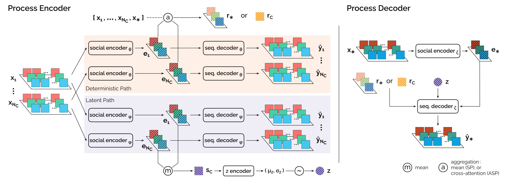

# Social Processes: Self-Supervised Forecasting of Nonverbal Cues in Social Conversations

This repository is the official implementation of the [Social Processes paper](https://openreview.net/forum?id=qcjOWDHAc4J).



## Requirements

Dependencies can be installed in a conda environment using `environment.yml`:

```setup
conda env create -f environment.yml
```

Note that some dependencies like the Blender3D `mathutils` package need to be installed with pip. In case the conda command above fails at first attempt, please try installing the packages listed under `pip` in the YAML file separately.

## Code Organization

Here's a brief overview of the main directories in this repo:

- **artefacts/datasets** : contains the processed and synthesized features, splits, and context sequence indices for the Haggling and Synthetic Glancing datasets.
- **data/**: contains code for data generation, preprocessing, loading, and custom type definition used throughout the codebase.
- **lightning/**: contains the code for the lightning modules, callbacks, and custom classes used in their definition.
- **models/**: contains pytorch code for the implementation of the components that constitute the Social Process and Neural Process models.
- **run/**: contains executable scripts for constructing and processing data, and training and evaluating models.
- **slurm/**: contains a convenience script for deploying tasks on a cluster.
- **train/**: contains implementations of the loss modules.

## Training

The main scripts for training the models in the paper are `run/run_synthetic_glancing.py` and `run/run_haggling.py`. The main difference between commands for the baseline and proposed models is in the `--model` parameter:

- baselines: `--model NEURAL_PROCESS`
- proposed: `--model SOCIAL_PROCESS --comonent <MLP/RNN>`

## Evaluation

The main scripts for evaluating the models in the paper are `run/run_synthetic_glancing.py` and `run/run_haggling_test.py`. As with training, the main difference between commands for the baseline and proposed models is in the `--model` parameter.

See `commands.md` for a list of the commands used to train and evaluate the models in the paper. It is recommended to use the `--help` argument to learn more about all
the available parameters. Additionally, the code is setup such that the parameters
relevant to a class are located in the class' implementation.

## Pre-trained Models

The `artefacts/datasets` directory contains two subdirectories. The `panoptic-haggling` directory
contains the processed features (`haggling-hbps.h5`), splits, training summary statistics for
standandardization, and context sequence indices for both the *random* and *fixed-initial* regimes.
The `synthetic` directory contains the data and context sequence indices for the
Glancing Behavior experiments.

The `artefacts/pretrained-models` directory contains the 19 models used in the paper experiments.

## Contributing

This repository (including all its contents) is available under the MIT license.
